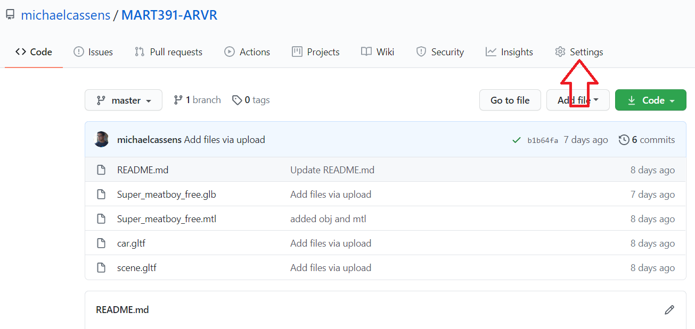
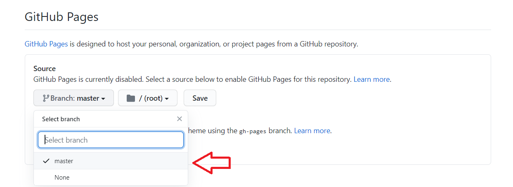
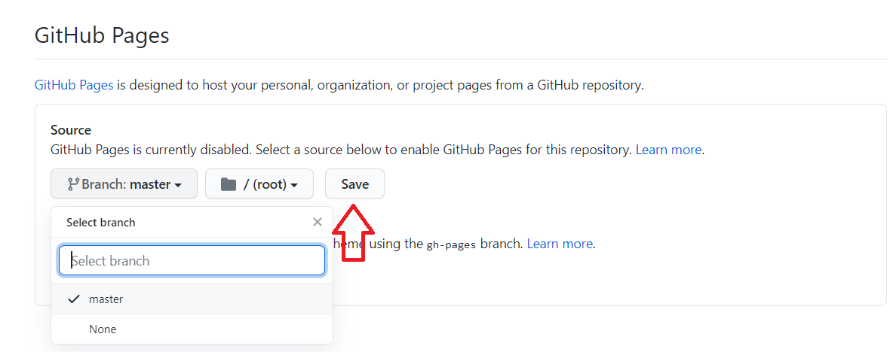
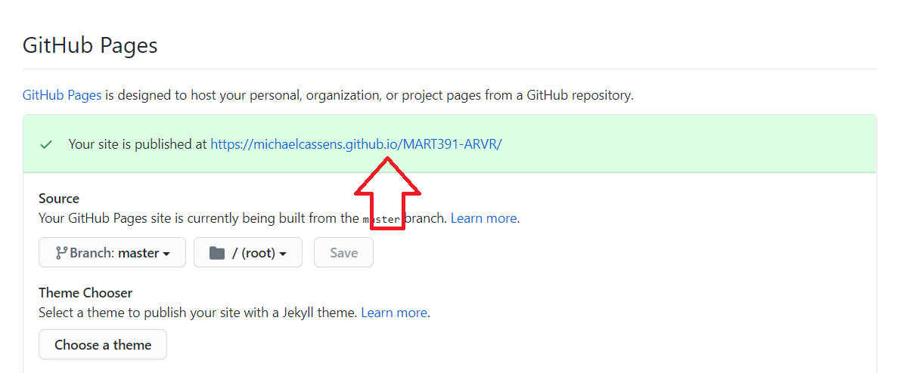

# Set Up GitHub

You all should have GitHub, so now, make sure GitHub Pages is active.

How do you do that?

Step 1 - Go to the Settings of your Repository

Step 2 - Scroll down to the GitHub Pages section

Step 3 - Choose the master branch

Step 4 - Save and wait

